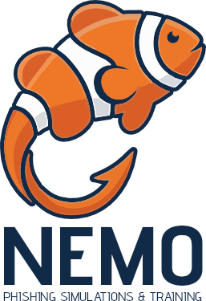

  <picture>
    <source media="(prefers-color-scheme: dark)" srcset="assets/logo-dark.png" />
    <source media="(prefers-color-scheme: light)" srcset="assets/logo-light.png" />
    
  </picture>
    

  
  
  

  
  
  
  

## 📖 Descrição
Este projeto consiste no desenvolvimento de um sistema de **simulação de ataques de phishing**, com o objetivo de avaliar o comportamento de usuários diante de e-mails suspeitos e promover a **conscientização sobre segurança da informação** por meio de conteúdos educativos.

O sistema enviará **e-mails simulados 📧** contendo links ou anexos configuráveis para usuários previamente cadastrados. A partir das interações realizadas (cliques em links ou abertura de anexos), serão coletados dados que permitirão analisar a **vulnerabilidade dos usuários** a esse tipo de ataque.

Além disso, o sistema disponibilizará **conteúdos educativos 📚** voltados ao ensino da importância de evitar **riscos cibernéticos 💻⚠️**.

---

## 🎯 Objetivo
Desenvolver um sistema capaz de **enviar campanhas simuladas de phishing** e **registrar o comportamento dos usuários** diante dessas mensagens.

---

## ⚙️ Funcionalidades
- 👤 Cadastro de destinatários (nome e e-mail)  
- 🎣 Criação de campanhas de phishing simulado  
- ✏️ Personalização de assunto, mensagem e anexos  
- 📤 Envio automático de e-mails  
- 🔎 Registro de cliques em links e abertura de anexos  
- 📊 Visualização de dados para análise de comportamento dos usuários  

---

## 🛠 Tecnologias (previstas)

**Front-end 🎨**
- HTML  
- CSS  
- JavaScript  
- React  
- Vite  

**Back-end ⚡**
- Node.js  
- React  
- Vite  

**Banco de Dados 🗄️**
- MySQL  

**Envio de E-mails 📧**
- SMTP  

---

## 🚀 Resultados Esperados
Espera-se que o sistema contribua para a **conscientização dos usuários sobre ataques de phishing**, além de permitir a aplicação de conhecimentos práticos relacionados a:

- 💻 Desenvolvimento de software  
- 🗄️ Banco de dados  
- 🔐 Segurança da informação  
